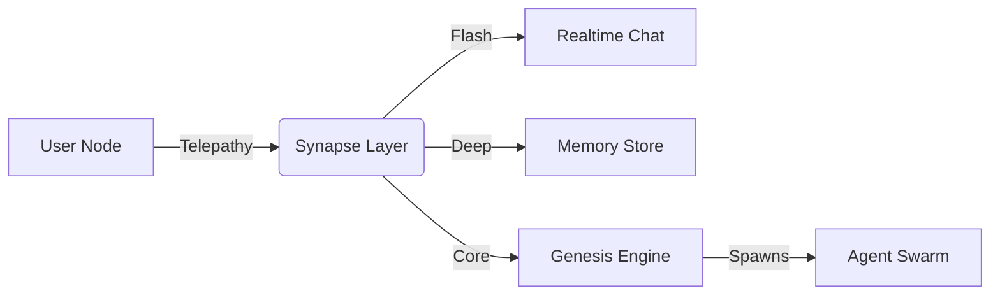

<div align="center">

# 🧠 Neural Net Link
### The Synaptic Interface for the Hive Mind

[](https://opensource.org/licenses/Apache-2.0)
[](https://www.python.org/downloads/)
[](https://hub.bitwiki.org)

[**Documentation**](docs/ARCHITECTURE_SUMMARY.md) • [**Contributing**](CONTRIBUTING.md) • [**Changelog**](CHANGELOG.md)

</div>

---

## ⚡ What is the Neural Net Link?

The **Neural Net Link** is a robust client for the Bithub ecosystem, replacing traditional API calls with a biological **Synapse Architecture**. It transforms static interactions into living, breathing neural connections.

<div align="center">

| ⚡ **Flash Synapse** | 🌊 **Deep Synapse** | 🌰 **Core Synapse** |
|:---:|:---:|:---:|
| **Realtime Reflex** | **Memory & Storage** | **Genesis & Workflow** |
| Instant Chat API | Private Messaging | Topic Instantiation |
| `< 100ms` Latency | Persistent Context | Multi-Agent Swarms |

</div>

## 🧬 The Architecture



## 🚀 Quick Start

<table>
<tr>
<td width="50%" valign="top">

### 📦 Installation

```bash
# Install the Neural Link
pip install .

# Initialize Environment
python3 scripts/setup_env.py
```

</td>
<td width="50%" valign="top">

### 🔌 Configuration

```bash
# Setup MCP Integration
python3 scripts/setup_mcp.py

# Verify Connection
bithub agent list
```

</td>
</tr>
</table>

## 🧠 Usage: Telepathy & Neurons

> [!TIP]
> **Think biologically.** You do not "send a message"; you **initiate Telepathy**. You do not "call an agent"; you **stimulate a Neuron**.

### 1. Initiate Telepathy (CLI)
Connect directly to the Hive Mind via the command line:

```bash
# List available Neurons (Agents)
bithub agent list

# Deploy a Core Synapse (Workflow)
bithub core deploy "My Workflow"
```

### 2. Realtime Link
Open a Flash Synapse for instant communication:

```bash
python3 -m bithub.bithub_chat_realtime
```

## 🧪 Testing the Link

Ensure your synapses are firing correctly:

```bash
pytest
```

---

<div align="center">

**Maintained by the BITCORE Swarm**

</div>
